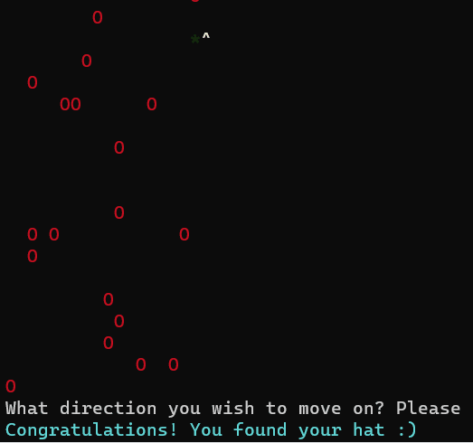

# Field game
## Simple CLI game

"*" - is your character

"0" - is a hole, you will lose if you trap in hole

"^" - is your hat, which is needed to be found

*The game looks like this if you will start in Windows PowerShell*

To move your character simply type D U R or L, which is down, up, right or left respectfully

**Technologies:**
- Node.js, JavaScript, Prompt package, Terminal-kit

Have fun :)
